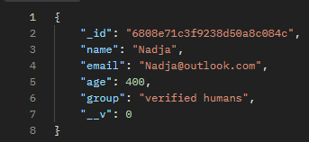

## Briefly about the API
In all its simplicity, the "app" establishes an asynchronous connection with a specified MongoDB Cluster, a certain database and the collections within, allowing for basic CRUD-operations.

I did not deviate much from the given instructions and the database schema largely follows the one that was already present.

## Available routes.

The app has five different routes. 

/getall, which fetches all documents within the collection.
-   for example, http://localhost:3000/api/getall would fetch everything within the file, or inform the user about a possible failure - for example, the collection might not exist or the user does not have the privileges for retrieving data from it.

/:id, which fetches a specific document from within the collection according to a given ID.
-   for example, http://localhost:3000/api/6808e71c3f9238d50a8c084c, would return the object with the 
given id. 

/add, which, as one might imagine, allows the user to add documents to the collections. The documents being students in this case.
-   After some trial and error and gathering information from various sources, it even has a validator for errors.

/update/:id, which allows the user to update/change aspects of a particular document.
- Basically, the user specifies a document using the document's ID and changes some variables within. 

/delete/:id, which deletes a document with the given id. Simple as.

## Error Handling 
I tried giving every route an appropriate status code in case it encountered an error, while also writing a middleware function that validates the form of the objectid, before it is forwarded onto the database, and another which validates the condition of the document fields when adding new students.

They are currently in their own little file and folder from with they are exported to the router file. Before that every route had its own little validator, but turns out that tactic does not result in particularly readable or clean code, so after gathering some information and receiving general tips from Le Chat, I wrote the middleware again into its own folder.

Besides that we use Mongoose's own functions to observe the connection's status. 
